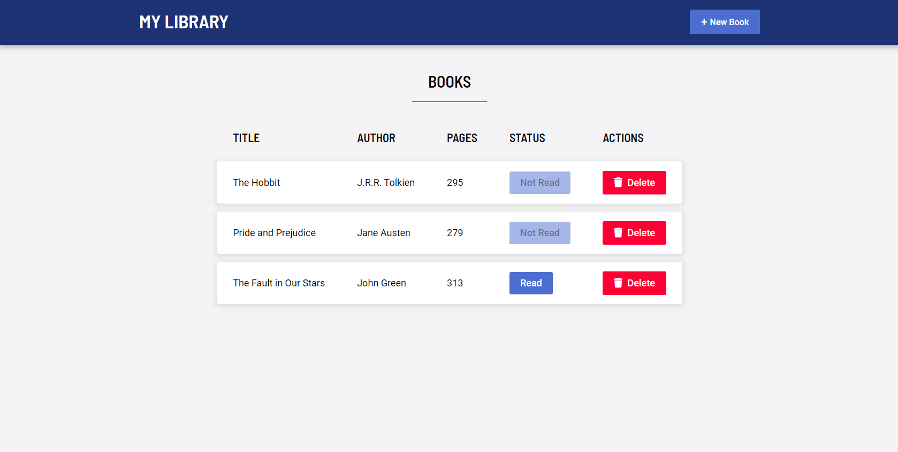

# Library

A simple library app that lets users keep track of which books they are reading. See the [live demo here](https://pa-aggarwal.github.io/library-app/)!

## Features

* Information shown about each book: the book's title, author, number of pages, and if it's been completed or not
* Delete button for removing books from the library
* Add button for adding a new book's information through a form
* Read status can be changed by clicking the status button

### To Add/Implement

Additional features that will help improve the user experience:

- [ ] Edit button for updating a book's information
- [ ] Add local storage to persist user's data after browser window closes
- [ ] Make application responsive for other non-desktop devices like mobile/tablets
- [ ] Indicate to the user when their library is empty
- [ ] Make header navigation fixed at top of the page
- [ ] Display confirmation message after user clicks delete button
- [ ] Allow h1 heading to be customizable by the user so they can enter their name 
